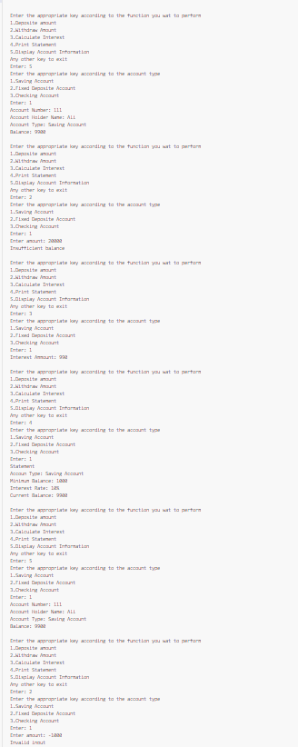
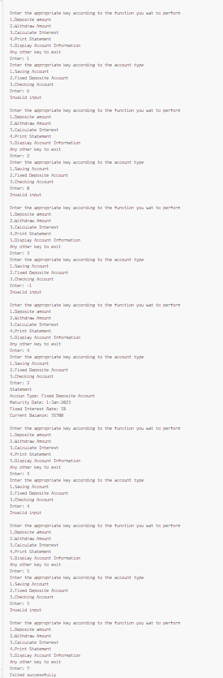
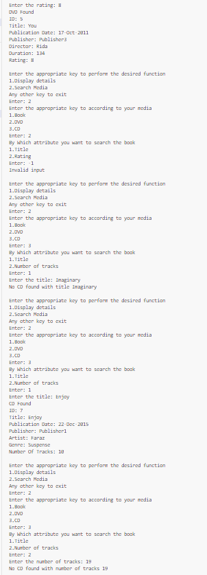

# OOP-LAB6-24K-0762

# C++ Code Repository

## Preview
Here are the sample outputs of the programs:

### Task 1 Output1:


### Task 1 Output2:


### Task 1 Output 3:


### Task 1 Output4:


### Task 1 Output 5:


### Task 1 Output 6:


### Task 1 Output 7:


### Task 1 Output 8:


### Task 1 Output 9:


### Task 1 Output 10:


### Task 1 Output11:


### Task 1 Output 12:


### Task 2:


### Task 3:


### Task 4 output 1:


### Task 4 output 2:


### Task 4 output:


### Task 5 output 1:


### Task 5 output 2:


### Task 5 output 3:


### Task 5 output 4:


### Task 5 output 5:


### Task 5 output 6:


### Task 5 output 7:


### Task 5 output 8:


---

## Code
Below are the C++ programs:

### Program 1: 
```cpp
#include<iostream>
using namespace std;
class Account{
    int accountNumber;
    string accountHolderName;
    protected:
        int balance;
        string accountType;
    public:
        Account(int number,int balance,string type,string name):accountNumber(number),balance(balance),accountType(type),accountHolderName(name){}
        void deposite(int amount){
            if(amount>0){
                balance+=amount;
                cout<<"Amount deposited successfully"<<endl;
            }
            else{
                cout<<"Invalid input"<<endl;
            }
        }
        virtual float calculateInterest(){
            return balance*(0/100.0);
        }
        virtual void printStatement(){
            cout<<"Statement"<<endl;
            cout<<"Interest Rate: 0%"<<endl;
            cout<<"Current Balance: "<<balance<<endl;    
        }
        virtual void withdraw(int amount){
            if(amount>=0){
                if(balance>=amount){
                    balance-=amount;
                    cout<<"Amount withdrawed successfully"<<endl;
                }
                else{
                    cout<<"Insufficient balance"<<endl;
                }
            }
            else{
                cout<<"Invalid input"<<endl;
            }
        }
        void getAccountInfo(){
            cout<<"Account Number: "<<accountNumber<<endl;
            cout<<"Account Holder Name: "<<accountHolderName<<endl;
            cout<<"Account Type: "<<accountType<<endl;
            cout<<"Balance: "<<balance<<endl;
        }
};
class SavingsAccount: public Account{
    int interestRate,minimumBalance;
    public:
        SavingsAccount(int number,int balance,string type,string name,int rate,int minimum):Account(number,balance,type,name),interestRate(rate),minimumBalance(minimum){}
        float calculateInterest(){
            return balance*(interestRate/100.0);
        }
        void printStatement(){
            cout<<"Statement"<<endl;
            cout<<"Accoun Type: "<<accountType<<endl;
            cout<<"Minimum Balance: "<<minimumBalance<<endl;
            cout<<"Interest Rate: "<<interestRate<<"%"<<endl;
            cout<<"Current Balance: "<<balance<<endl;    
        }
        void withdraw(int amount){
            if(amount>=0){
                if(balance>=amount){
                    balance-=amount;
                    cout<<"Amount withdrawed successfully"<<endl;
                    cout<<"Current balance: "<<balance<<endl;
                    cout<<"Applying interest"<<endl;
                    balance+=calculateInterest();
                    cout<<"Interest amount: "<<calculateInterest();
                }
                else{
                    cout<<"Insufficient balance"<<endl;
                }
            }
            else{
                cout<<"Invalid input"<<endl;
            }
        }
};
class FixedDepositeAccount: public Account{
    const int fixedInterestRate;
    string maturityDate;
    public:
        FixedDepositeAccount(int number,int balance,string type,string name,int rate,string date):Account(number,balance,type,name),fixedInterestRate(rate),maturityDate(date){}
        float calculateInterest(){
            return balance*(fixedInterestRate/100.0);;
        }
        void printStatement(){
            cout<<"Statement"<<endl;
            cout<<"Accoun Type: "<<accountType<<endl;
            cout<<"Maturity Date: "<<maturityDate<<endl;
            cout<<"Fixed Interest Rate: "<<fixedInterestRate<<"%"<<endl;
            cout<<"Current Balance: "<<balance<<endl;    
        }
        void withdraw(int amount){
            if(amount>=0){
                if(balance>=amount){
                    balance-=amount;
                    cout<<"Amount withdrawed successfully"<<endl;
                    cout<<"Current balance: "<<balance<<endl;
                    cout<<"Applying interest"<<endl;
                    balance+=calculateInterest();
                    cout<<"Interest amount: "<<calculateInterest();
                }
                else{
                    cout<<"Insufficient balance"<<endl;
                }
            }
            else{
                cout<<"Invalid input"<<endl;
            }
        }
};
class CheckingAccount: public Account{
    int interestRate;
    public:
        CheckingAccount(int number,int balance,string type,string name,int rate):Account(number,balance,type,name),interestRate(rate){}
        float calculateInterest(){
            return balance*(interestRate/100.0);
        }
        void printStatement(){
            cout<<"Statement"<<endl;
            cout<<"Accoun Type: "<<accountType<<endl;
            cout<<"Interest Rate: "<<interestRate<<"%"<<endl;
            cout<<"Current Balance: "<<balance<<endl;    
        }
        void withdraw(int amount){
            if(amount>=0){
                if(balance>=amount){
                    balance-=amount;
                    cout<<"Amount withdrawed successfully"<<endl;
                    cout<<"Current balance: "<<balance<<endl;
                    cout<<"Applying interest"<<endl;
                    balance+=calculateInterest();
                    cout<<"Interest amount: "<<calculateInterest();
                }
                else{
                    cout<<"Insufficient balance"<<endl;
                }
            }
            else{
                cout<<"Invalid input"<<endl;
            }
        }
};
int main(){
    Account *acc;
    int acc_num,balance,rate,minimum;
    string name,date;
    cout<<"For Saving Account"<<endl;
    cout<<"Enter Account Number: ";
    cin>>acc_num;
    cout<<"Enter Account Holder Name: ";
    cin>>name;
    cout<<"Enter Balance: ";
    cin>>balance;
    cout<<"Enter Interest Rate: ";
    cin>>rate;
    cout<<"Enter minimum balance: ";
    cin>>minimum;
    SavingsAccount saving(acc_num,balance,"Saving Account",name,rate,minimum);
    cout<<endl<<"For Fixed Deposite Account"<<endl;
    cout<<"Enter Account Number: ";
    cin>>acc_num;
    cout<<"Enter Account Holder Name: ";
    cin>>name;
    cout<<"Enter Balance: ";
    cin>>balance;
    cout<<"Enter Fixed Interest Rate: ";
    cin>>rate;
    cout<<"Enter maturity date: ";
    cin>>date;
    FixedDepositeAccount fixed(acc_num,balance,"Fixed Deposite Account",name,rate,date);
    cout<<endl<<"For Checking Account"<<endl;
    cout<<"Enter Account Number: ";
    cin>>acc_num;
    cout<<"Enter Account Holder Name: ";
    cin>>name;
    cout<<"Enter Balance: ";
    cin>>balance;
    cout<<"Enter Interest Rate: ";
    cin>>rate;
    CheckingAccount checking(acc_num,balance,"Checking Account",name,rate);    
    int c1,c2;
    while(1){
        cout<<endl<<"Enter the appropriate key according to the function you wat to perform\n1.Deposite amount\n2.Withdraw Amount\n3.Calculate Interest\n4.Print Statement\n5.Display Account Information\nAny other key to exit\nEnter: ";
        cin>>c1;
        switch(c1){
            case 1:
                cout<<"Enter the appropriate key according to the account type\n1.Saving Account\n2.Fixed Deposite Account\n3.Checking Account\nEnter: ";
                cin>>c2;
                switch(c2){
                    case 1:
                        cout<<"Enter amount: ";
                        cin>>balance;
                        acc=&saving;
                        acc->deposite(balance);
                        break;
                    case 2:
                        cout<<"Enter amount: ";
                        cin>>balance;
                        acc=&fixed;
                        acc->deposite(balance);
                        break;
                    case 3:
                        cout<<"Enter amount: ";
                        cin>>balance;
                        acc=&checking;
                        acc->deposite(balance);
                        break;
                    default:
                        cout<<"Invalid input"<<endl;
                }
                break;
            case 2:
                cout<<"Enter the appropriate key according to the account type\n1.Saving Account\n2.Fixed Deposite Account\n3.Checking Account\nEnter: ";
                cin>>c2;
                switch(c2){
                    case 1:
                        cout<<"Enter amount: ";
                        cin>>balance;
                        acc=&saving;
                        acc->withdraw(balance);
                        break;
                    case 2:
                        cout<<"Enter amount: ";
                        cin>>balance;
                        acc=&fixed;
                        acc->withdraw(balance);
                        break;
                    case 3:
                        cout<<"Enter amount: ";
                        cin>>balance;
                        acc=&checking;
                        acc->withdraw(balance);
                        break;
                    default:
                        cout<<"Invalid input"<<endl;
                }
                break;
            case 3:
                cout<<"Enter the appropriate key according to the account type\n1.Saving Account\n2.Fixed Deposite Account\n3.Checking Account\nEnter: ";
                cin>>c2;
                switch(c2){
                    case 1:
                        acc=&saving;
                        cout<<"Interest Ammount: "<<acc->calculateInterest()<<endl;
                        break;
                    case 2:
                        acc=&fixed;
                        cout<<"Interest Ammount: "<<acc->calculateInterest()<<endl;
                        break;
                    case 3:
                        acc=&checking;
                        cout<<"Interest Ammount: "<<acc->calculateInterest()<<endl;
                        break;
                    default:
                        cout<<"Invalid input"<<endl;
                }
                break;
            case 4:
                cout<<"Enter the appropriate key according to the account type\n1.Saving Account\n2.Fixed Deposite Account\n3.Checking Account\nEnter: ";
                cin>>c2;
                switch(c2){
                    case 1:
                        acc=&saving;
                        acc->printStatement();
                        break;
                    case 2:
                        acc=&fixed;
                        acc->printStatement();
                        break;
                    case 3:
                        acc=&checking;
                        acc->printStatement();
                        break;
                    default:
                        cout<<"Invalid input"<<endl;
                }
                break;
            case 5:
                cout<<"Enter the appropriate key according to the account type\n1.Saving Account\n2.Fixed Deposite Account\n3.Checking Account\nEnter: ";
                cin>>c2;
                switch(c2){
                    case 1:
                        acc=&saving;
                        acc->getAccountInfo();
                        break;
                    case 2:
                        acc=&fixed;
                        acc->getAccountInfo();
                        break;
                    case 3:
                        acc=&checking;
                        acc->getAccountInfo();
                        break;
                    default:
                        cout<<"Invalid input"<<endl;
                }
                break;
            default:
                cout<<"Exited successfully"<<endl;
                return 0;
        }
    }    
}


## Code
Below are the C++ programs:

### Program 2: 
```cpp
#include<iostream>
#include<math.h>
using namespace std;
class Shape{
    protected:
        string position,color;
        int borderThickness;
    public:
        Shape(string color,string pos,int thickness):color(color),position(pos),borderThickness(thickness){}
        virtual void draw(){
            cout<<"A "<<color<<" shape is drawn in the "<<position<<" have border thickness "<<borderThickness<<"cm"<<endl;
        }
        virtual void calculateArea(){
            cout<<"Area is 0"<<endl;
        }
        virtual void calculatePerimeter(){
            cout<<"Perimeter is 0"<<endl;
        }
};
class Circle: public Shape{
    int radius;
    public:
    Circle(string color,string pos,int thickness,int r):Shape(color,pos,thickness),radius(r){}
        void draw(){
            cout<<"A "<<color<<" circle is drawn in the "<<position<<" have border thickness "<<borderThickness<<"cm and radius "<<radius<<endl;
        }
        void calculateArea(){
            float area=3.142*radius*radius;
            cout<<"Area is "<<area<<endl;
        }
        void calculatePerimeter(){
            float perimeter=2*radius*3.142;
            cout<<"Perimeter is "<<perimeter<<endl;
        }
};
class Rectangle: public Shape{
    int width,height;
    public:
    Rectangle(string color,string pos,int thickness,int w,int h):Shape(color,pos,thickness),width(w),height(h){}
        void draw(){
            cout<<"A "<<color<<" rectangle is drawn in the "<<position<<" have border thickness "<<borderThickness<<"cm, width "<<width<<" and height "<<height<<endl;
        }
        void calculateArea(){
            int area=width*height;
            cout<<"Area is "<<area<<endl;
        }
        void calculatePerimeter(){
            int perimeter=2*(width+height);
            cout<<"Perimeter is "<<perimeter<<endl;
        }
};
class Triangle: public Shape{
    int base,height;
    public:
    Triangle(string color,string pos,int thickness,int b,int h):Shape(color,pos,thickness),base(b),height(h){}
        void draw(){
            cout<<"A "<<color<<" triangle is drawn in the "<<position<<" have border thickness "<<borderThickness<<"cm, base "<<base<<" and height "<<height<<endl;
        }
        void calculateArea(){
            float area=0.5*(base*height);
            cout<<"Area is "<<area<<endl;
        }
        void calculatePerimeter(){
            float perimeter=base+height+sqrt(pow(base,2.0)+pow(height,2.0));
            cout<<"Perimeter is "<<perimeter<<endl;
        }
};
class Polygon: public Shape{
    int n,l,r;
    public:
        Polygon(string color,string pos,int thickness,int n,int l,int r):Shape(color,pos,thickness),n(n),l(l),r(r){}
        void draw(){
            cout<<"A "<<color<<" polygon is drawn in the "<<position<<" have border thickness "<<borderThickness<<"cm,"<<n<<" sides each having lenght "<<l<<"and radius of inscribe circle is "<<r<<endl;
        }
        void calculateArea(){
            float area=(n/2.0)*(l*r);
            cout<<"Area is "<<area<<endl;
        }
        void calculatePerimeter(){
            int perimeter=n*l;
            cout<<"Perimeter is "<<perimeter<<endl;
        }
};
int main(){
    string color,pos;
    int r,border,w,h,b,l,n;
    Shape *s;
    cout<<"Enter the color of the circle: ";
    cin>>color;
    cout<<"Enter the border thickness of the circle: ";
    cin>>border;
    cout<<"Enter the radius of the circle: ";
    cin>>r;
    Circle c(color,"center",border,r);
    s=&c;
    cout<<"Drawing the circle"<<endl;
    s->draw();
    s->calculateArea();
    s->calculatePerimeter();
    cout<<endl<<"Enter the color of the rectangle: ";
    cin>>color;
    cout<<"Enter the border thickness of the rectangle: ";
    cin>>border;
    cout<<"Enter the width of the rectangle: ";
    cin>>w;
    cout<<"Enter the height of the rectangle: ";
    cin>>h;
    Rectangle rec(color,"top-left corner",border,w,h);
    s=&rec;
    cout<<"Drawing the rectangle"<<endl;
    s->draw();
    s->calculateArea();
    s->calculatePerimeter();
    cout<<endl<<"Enter the color of the triangle: ";
    cin>>color;
    cout<<"Enter the border thickness of the triangle: ";
    cin>>border;
    cout<<"Enter the position of the triangle: ";
    cin>>pos;
    cout<<"Enter the base of the triangle: ";
    cin>>b;
    cout<<"Enter the height of the triangle: ";
    cin>>h;
    Triangle t(color,pos,border,b,h);
    s=&t;
    cout<<"Drawing the triangle"<<endl;
    s->draw();
    s->calculateArea();
    s->calculatePerimeter();
    cout<<endl<<"Enter the color of the polygon: ";
    cin>>color;
    cout<<"Enter the border thickness of the polygon: ";
    cin>>border;
    cout<<"Enter the position of the polygon: ";
    cin>>pos;
    cout<<"How many sides are there in polygon: ";
    cin>>n;
    cout<<"Enter lenght of each side: ";
    cin>>l;
    cout<<"Enter the radius of the inscribe circle: ";
    cin>>r;
    Polygon p(color,pos,border,n,l,r);
    s=&p;
    cout<<"Drawing the polygon"<<endl;
    s->draw();
    s->calculateArea();
    s->calculatePerimeter();
    return 0;
}


## Code
Below are the C++ programs:

### Program 3: 
```cpp
#include<iostream>
using namespace std;
class Currency{
    protected:
        string currencyCode,currencySymbol;
        float amount,exchangeRate;
    public:
        Currency(float amount,float rate,string code,string symbol):amount(amount),exchangeRate(rate),currencySymbol(symbol),currencyCode(code){}
        virtual float convertToBase(){
            return amount*exchangeRate;
        }
        virtual void display(){
            cout<<amount<<" "<<currencyCode;
        }
        void convertTO(Currency &targetCurrency){
            float base=convertToBase();
            float converted=base/targetCurrency.exchangeRate;
            display();
            cout<<"="<<converted<<" "<<targetCurrency.currencyCode<<endl;
        }
};
class Dollar: public Currency{
    public:
        Dollar(float amount):Currency(amount,277,"USD","$"){}
        float convertToBase(){
            return amount*277;
        }
        void display(){
            cout<<amount<<" "<<currencyCode;
        }
};
class Euro: public Currency{
    public:
        Euro(float amount):Currency(amount,300,"EUR","€"){}
        float convertToBase(){
            return amount*300;
        }
        void display(){
            cout<<amount<<" "<<currencyCode;
        }
};
class Rupee: public Currency{
    public:
        Rupee(float amount):Currency(amount,3.34,"INR","?"){}
        float convertToBase(){
            return amount*3.34;
        }
        void display(){
            cout<<amount<<" "<<currencyCode;
        }
};
int main(){
    float usd_amount,euro_amount,rupee_amount,converted;
    Currency *curr;
    cout<<"Enter the amount in USD: ";
    cin>>usd_amount;
    cout<<"Enter the amount in EUR: ";
    cin>>euro_amount;
    cout<<"Enter the amount in Indian Rupee: ";
    cin>>rupee_amount;
    Dollar usd(usd_amount);
    Euro euro(euro_amount);
    Rupee rupee(rupee_amount);
    curr=&usd;
    converted=curr->convertToBase();
    cout<<usd_amount<<" USD in base currency(PKR)="<<converted<<" PKR"<<endl;
    curr->convertTO(euro);
    curr->convertTO(rupee);
    curr=&euro;
    converted=curr->convertToBase();
    cout<<euro_amount<<" EUR in base currency(PKR)="<<converted<<" PKR"<<endl;
    curr->convertTO(usd);
    curr->convertTO(rupee);
    curr=&rupee;
    converted=curr->convertToBase();
    cout<<rupee_amount<<" INR in base currency(PKR)="<<converted<<" PKR"<<endl;
    curr->convertTO(usd);
    curr->convertTO(euro);
    return 0;
}


## Code
Below are the C++ programs:

### Program 4: 
```cpp

#include<iostream>
using namespace std;
class Student;
class Course{
    int courseid,credits,numStudents=0;
    string instructor,schedule;
    Student *students[100];
    public:
        string courseName;
        Course(int id,int credits,string name,string instructor,string schedule):courseid(id),courseName(name),instructor(instructor),schedule(schedule){}
        void registerStudent(Student &s){
            students[numStudents]=&s;
            numStudents++;
            cout<<"Studnet registered successfully"<<endl;
        }
        void calculateGrade(Student &s){
            int found=0;
            for (int i = 0; i < 100; i++)
            {
                if(students[i]==&s){
                    found=1;
                    break;
                }    
            }
            if(!found){
                cout<<"No such student is registered in this course";
            }
            else{
                int marks;
                cout<<"Enter your marks: ";
                cin>>marks;
                cout<<"Grade: ";
                if(marks>=80){
                    cout<<"A+";
                }
                else if(marks>=70){
                    cout<<"A";
                }
                else if(marks>=60){
                    cout<<"B";
                }
                else if(marks>=50){
                    cout<<"C";
                }
                else if(marks>=40){
                    cout<<"D";
                }
                else{
                    cout<<"Fail";
                }
                cout<<endl;
            }
        }
};
class Person{
    int id;
    string name,address,phoneNumber,email;
    public:
        Person(int id,string name,string add,string phone,string email){
            this->id=id;
            this->name=name;
            address=add;
            phoneNumber=phone;
            this->email=email;
        }
        virtual void displayInfo(){
            cout<<"ID: "<<id<<endl;
            cout<<"Name: "<<name<<endl;
            cout<<"Address: "<<address<<endl;
            cout<<"Phone Number: "<<phoneNumber<<endl;
            cout<<"Email: "<<email<<endl;
        }
        void updateInfo(){
            cout<<"Enter ID: ";
            cin>>id;
            cout<<"Enter name: ";
            cin>>name;
            cout<<"Ennter address: ";
            cin>>address;
            cout<<"Enter phone number: ";
            cin>>phoneNumber;
            cout<<"Enter email: ";
            cin>>email;
        }
};
class Student: public Person{
    int enrollmentYear,numCourses;
    float GPA;
    Course *coursesEnrolled[20];
    public:
        Student(int id,string name,string add,string phone,string email,float gpa,int year,Course *courses[],int n):Person(id,name,add,phone,email),GPA(gpa),enrollmentYear(year){
            numCourses=n;
            for(int i=0;i<n;i++){
                coursesEnrolled[i]=*(courses+i);
            }
        }
        void displayInfo(){
            Person::displayInfo();
            cout<<"Enrollment Year: "<<enrollmentYear<<endl;
            cout<<"Courses Enrolled"<<endl;
            for (int i = 0; i < numCourses; i++)
            {
                cout<<"\t"<<i+1<<". "<<coursesEnrolled[i]->courseName<<endl;
            }
            cout<<"GPA: "<<GPA<<endl;
        }
};
class Professor: public Person{
    int salary,numCourses;
    string department;
    Course *coursesTaught[20];
    public:
        Professor(int id,string name,string add,string phone,string email,string dept,int sal,Course *courses[],int n):Person(id,name,add,phone,email),department(dept),salary(sal){
            numCourses=n;
            for(int i=0;i<n;i++){
                coursesTaught[i]=courses[i];
            }
        }
        void displayInfo(){
            Person::displayInfo();
            cout<<"Department: "<<department<<endl;;
            cout<<"Cources Taught"<<endl;
            for (int i = 0; i < numCourses; i++)
            {
                cout<<"\t"<<i+1<<". "<<coursesTaught[i]->courseName<<endl;
            }
            cout<<"Salary: "<<salary<<endl;
        }
};
class Staff: public Person{
    int salary;
    string department,position;
    public:
        Staff(int id,string name,string add,string phone,string email,string dept,int sal,string pos):Person(id,name,add,phone,email),department(dept),salary(sal),position(pos){}
        void displayInfo(){
            Person::displayInfo();
            cout<<"Department: "<<department<<endl;;
            cout<<"Position: "<<position<<endl;
            cout<<"Salary: "<<salary<<endl;
        }
};
int main(){
    Course *courses[100];
    Person *person;
    int num,year,person_id,n,credits,course_id,salary;
    float gpa;
    string pos,dept,person_name,address,phoneNumber,email,course_name,instructor,schedule;
    cout<<"Enter ID of the student: ";
    cin>>person_id;
    cout<<"Enter name of the student: ";
    cin>>person_name;
    cout<<"Ennter address of the student: ";
    cin>>address;
    cout<<"Enter phone number of the student: ";
    cin>>phoneNumber;
    cout<<"Enter email of student: ";
    cin>>email;
    cout<<"Enter your GPA: ";
    cin>>gpa;
    cout<<"Enter your enrollement year: ";
    cin>>year;
    cout<<"In how many courses are you enrolled in: ";
    cin>>n;
    for (int i = 0; i < n; i++)
    {
        cout<<"For course "<<i+1<<endl;        
        cout<<"Enter ID of the course: ";
        cin>>course_id;
        cout<<"Enter name of the course: ";
        cin>>course_name;
        cout<<"Enter no of credits: ";
        cin>>credits;
        cout<<"Enter the instructor: ";
        cin>>instructor;
        cout<<"Enter the schedule: ";
        cin>>schedule;
        cout<<endl;
        courses[i]=new Course(course_id,credits,course_name,instructor,schedule);
    }
    Student s(person_id,person_name,address,phoneNumber,email,gpa,year,courses,n);
    for (int i = 0; i < n; i++)
    {
        courses[i]->registerStudent(s);
    }
    person=&s;
    cout<<"Displaying student;s details"<<endl;
    person->displayInfo();
    cout<<"Calculaing grade of each course"<<endl;
    for (int i = 0; i < n; i++)
    {
        cout<<"For course "<<i+1<<endl;
        courses[i]->calculateGrade(s);
        cout<<endl;
    }
    char update;
    cout<<"Do you want to uodate your personal information (Enter 'y' or 'Y' for yes or else anything for no): ";
    cin>>update;
    while(update=='y'||update=='Y'){
        person->updateInfo();
        cout<<"Displaying updated information: "<<endl;
        person->displayInfo();
        cout<<"Do you want to uodate your personal information again(Enter 'y' or 'Y' for yes or else anything for no): ";
        cin>>update;
    }
    num=n;
    cout<<endl<<"Enter ID of the professor: ";
    cin>>person_id;
    cout<<"Enter name of the professor: ";
    cin>>person_name;
    cout<<"Ennter address of the professor: ";
    cin>>address;
    cout<<"Enter phone number of the professor: ";
    cin>>phoneNumber;
    cout<<"Enter email of professor: ";
    cin>>email;
    cout<<"Enter your department: ";
    cin>>dept;
    cout<<"Enter your salary: ";
    cin>>salary;
    cout<<"How many courses do you teach: ";
    cin>>n;
    for (int i = 0; i < n; i++)
    {
        cout<<"For course "<<i+1<<endl;        
        cout<<"Enter ID of the course: ";
        cin>>course_id;
        cout<<"Enter name of the course: ";
        cin>>course_name;
        cout<<"Enter no of credits: ";
        cin>>credits;
        cout<<"Enter the schedule: ";
        cin>>schedule;
        cout<<endl;
        courses[i]=new Course(course_id,credits,course_name,person_name,schedule);
    }
    Professor p(person_id,person_name,address,phoneNumber,email,dept,salary,courses,n); 
    person=&p;
    cout<<"Displaying professor's details"<<endl;
    person->displayInfo();
    cout<<"Do you want to uodate your personal information (Enter 'y' or 'Y' for yes or else anything for no): ";
    cin>>update;
    while(update=='y'||update=='Y'){
        person->updateInfo();
        cout<<"Displaying updated information: "<<endl;
        person->displayInfo();
        cout<<"Do you want to uodate your personal information again(Enter 'y' or 'Y' for yes or else anything for no): ";
        cin>>update;
    }
    cout<<endl<<"Enter ID of the staff: ";
    cin>>person_id;
    cout<<"Enter name of the staff: ";
    cin>>person_name;
    cout<<"Ennter address of the staff: ";
    cin>>address;
    cout<<"Enter phone number of the staff: ";
    cin>>phoneNumber;
    cout<<"Enter email of staff: ";
    cin>>email;
    cout<<"Enter your department: ";
    cin>>dept;
    cout<<"Enter your salary: ";
    cin>>salary;            
    cout<<"Enter the position: ";
    cin>>pos;
    Staff st(person_id,person_name,address,phoneNumber,email,dept,salary,pos); 
    person=&st;
    cout<<"Displaying staff's details"<<endl;
    person->displayInfo();
    cout<<"Do you want to uodate your personal information (Enter 'y' or 'Y' for yes or else anything for no): ";
    cin>>update;
    while(update=='y'||update=='Y'){
        person->updateInfo();
        cout<<"Displaying updated information: "<<endl;
        person->displayInfo();
        cout<<"Do you want to uodate your personal information again(Enter 'y' or 'Y' for yes or else anything for no): ";
        cin>>update;
    }
    delete[] courses;
    return 0;
}


## Code
Below are the C++ programs:

### Program 5: 
```cpp
#include<iostream>
#include<string>
using namespace std;
class Media{
    int uniqueID;
    static int counter;
    string publicationDate,publisher,title;
    public:
        Media(string title,string date,string pub):uniqueID(counter++),title(title),publicationDate(date),publisher(pub){}
        void displayInfo(){
            cout<<"ID: "<<uniqueID<<endl;
            cout<<"Title: "<<title<<endl;
            cout<<"Publication Date: "<<publicationDate<<endl;
            cout<<"Publisher: "<<publisher<<endl;
        }
        int search(string title){
            if(this->title==title){
                return 1;
            }
            else{
                return 0;
            }
        }
};
class Book: public Media{
    int ISBN,numberOfPages;
    string author;
    public:
        Book(string title,string date,string pub,int isbn,int pages,string author):Media(title,date,pub),ISBN(isbn),numberOfPages(pages),author(author){}
        void displayInfo(){
            Media::displayInfo();
            cout<<"ISBN: "<<ISBN<<endl;
            cout<<"Author: "<<author<<endl;
            cout<<"Number Of Pages: "<<numberOfPages<<endl;
        }
        int search(int isbn){
            if(ISBN==isbn){
                return 1;
            }
            else{
                return 0;
            }
        }
};
class DVD: public Media{
    int rating,duration;
    string director;
    public:
        DVD(string title,string date,string pub,int rate,int dur,string director):Media(title,date,pub),rating(rate),duration(dur),director(director){}
        void displayInfo(){
            Media::displayInfo();
            cout<<"Director: "<<director<<endl;
            cout<<"Duration: "<<duration<<endl;
            cout<<"Rating: "<<rating<<endl;
        }
        int search(int rate){
            if(rating==rate){
                return 1;
            }
            else{
                return 0;
            }
        }
};
class CD: public Media{
    int numberOfTracks;
    string artist,genre;
    public:
        CD(string title,string date,string pub,int tracks,string artist,string genre):Media(title,date,pub),artist(artist),numberOfTracks(tracks),genre(genre){}
        void displayInfo(){
            Media::displayInfo();
            cout<<"Artist: "<<artist<<endl;
            cout<<"Genre: "<<genre<<endl;
            cout<<"Number Of Tracks: "<<numberOfTracks<<endl;
        }
        int search(int tracks){
            if(numberOfTracks==tracks){
                return 1;
            }
            else{
                return 0;
            }
        }
};
int Media::counter=1;
int main(){
    Media *media;
    int rating,dur,book_num,dvd_num,cd_num,isbn,pages,tracks;
    string title,date,publisher,author,director,artist,genre;
    cout<<"How many books are there: ";
    cin>>book_num;
    Book *books[book_num];
    cout<<"Enter details for each book"<<endl;
    for (int i = 0; i < book_num; i++)
    {
        cout<<endl<<"For Book "<<i+1<<endl;
        cout<<"Enter title: ";
        cin>>title;
        cout<<"Enter publication date: ";
        cin>>date;
        cout<<"Enter publisher: ";
        cin>>publisher;
        cout<<"Enter author: ";
        cin>>author;
        cout<<"Enter ISBN: ";
        cin>>isbn;
        cout<<"Enter number of pages: ";
        cin>>pages;
        books[i]=new Book(title,date,publisher,isbn,pages,author);
    }
    cout<<endl<<"How many DVDs are there: ";
    cin>>dvd_num;
    DVD *dvds[dvd_num];
    cout<<"Enter details for each DVD"<<endl;
    for (int i = 0; i < dvd_num; i++)
    {
        cout<<endl<<"For DVD "<<i+1<<endl;
        cout<<"Enter title: ";
        cin>>title;
        cout<<"Enter publication date: ";
        cin>>date;
        cout<<"Enter publisher: ";
        cin>>publisher;
        cout<<"Enter director: ";
        cin>>director;
        cout<<"Enter duration: ";
        cin>>dur;
        cout<<"Enter rating: ";
        cin>>rating;
        dvds[i]=new DVD(title,date,publisher,rating,dur,director);
    }
    cout<<endl<<"How many CDs are there: ";
    cin>>cd_num;
    CD *cds[cd_num];
    cout<<"Enter details for each CD"<<endl;
    for (int i = 0; i < cd_num; i++)
    {
        cout<<endl<<"For CD "<<i+1<<endl;
        cout<<"Enter title: ";
        cin>>title;
        cout<<"Enter publication date: ";
        cin>>date;
        cout<<"Enter publisher: ";
        cin>>publisher;
        cout<<"Enter artist: ";
        cin>>artist;
        cout<<"Enter genre: ";
        cin>>genre;
        cout<<"Enter number of tracks: ";
        cin>>tracks;
        cds[i]=new CD(title,date,publisher,tracks,artist,genre);
    }
    int c1,c2,c3;
    while(1){
        cout<<"Enter the appropriate key to perform the desired function\n1.Display details\n2.Search Media\nAny other key to exit\nEnter: ";
        cin>>c1;
        switch(c1){
            case 1:
                cout<<"Enter the appropriate key to according to your media\n1.Book\n2.DVD\n3.CD\nEnter: ";
                cin>>c2;
                switch(c2){
                    case 1:
                        if(book_num!=0){
                            for(int i=0;i<book_num;i++){
                                cout<<endl<<"Book "<<i+1<<endl;
                                books[i]->displayInfo();                                            }
                        }
                        else{
                            cout<<"No book found"<<endl;
                        }
                        break;
                    case 2:
                        if(dvd_num!=0){
                            for(int i=0;i<dvd_num;i++){
                                cout<<endl<<"DVD "<<i+1<<endl;
                                dvds[i]->displayInfo();                                            }
                        }
                        else{
                            cout<<"No DVD found"<<endl;
                        }
                        break;
                    case 3:
                        if(cd_num!=0){
                        for(int i=0;i<cd_num;i++){
                            cout<<endl<<"CD "<<i+1<<endl;
                            cds[i]->displayInfo();                                            }
                        }
                        else{
                            cout<<"No CD found"<<endl;
                        }    
                        break;
                    default:
                        cout<<"Invalid input"<<endl;
                }
                break;
            case 2:
                cout<<"Enter the appropriate key to according to your media\n1.Book\n2.DVD\n3.CD\nEnter: ";
                cin>>c2;
                switch(c2){
                    case 1:
                        cout<<"By Which attribute you want to search the book\n1.Title\n2.ISBN\nEnter: ";
                        cin>>c3;
                        if(c3==1){
                            int found=0;
                            cout<<"Enter the title: ";
                            cin>>title;
                            for(int i=0;i<book_num;i++){
                                media=books[i];
                                if(media->search(title)){
                                    found=1;
                                    cout<<"Book Found"<<endl;
                                    books[i]->displayInfo();
                                    break;
                                }
                            }
                            if(!found){
                                cout<<"No book found with title "<<title<<endl;
                            }
                        }
                        else if(c3==2){
                            int found=0;
                            cout<<"Enter the ISBN: ";
                            cin>>isbn;
                            for(int i=0;i<book_num;i++){
                                if(books[i]->search(isbn)){
                                    found=1;
                                    cout<<"Book Found"<<endl;
                                    books[i]->displayInfo();
                                    break;
                                }
                            }
                            if(!found){
                                cout<<"No book found with ISBN "<<isbn<<endl;
                            }
                        }
                        else{
                            cout<<"Invalid input"<<endl;
                        }
                        break;
                    case 2:
                        cout<<"By Which attribute you want to search the book\n1.Title\n2.Rating\nEnter: ";
                        cin>>c3;
                        if(c3==1){
                            int found=0;
                            cout<<"Enter the title: ";
                            cin>>title;
                            for(int i=0;i<dvd_num;i++){
                                media=dvds[i];
                                if(media->search(title)){
                                    found=1;
                                    cout<<"DVD Found"<<endl;
                                    dvds[i]->displayInfo();
                                    break;
                                }
                            }
                            if(!found){
                                cout<<"No DVD found with title "<<title<<endl;
                            }
                        }
                        else if(c3==2){
                            int found=0;
                            cout<<"Enter the rating: ";
                            cin>>rating;
                            for(int i=0;i<dvd_num;i++){
                                if(dvds[i]->search(rating)){
                                    found=1;
                                    cout<<"DVD Found"<<endl;
                                    dvds[i]->displayInfo();
                                    break;
                                }
                            }
                            if(!found){
                                cout<<"No DVD found with rating "<<rating<<endl;
                            }
                        }
                        else{
                            cout<<"Invalid input"<<endl;
                        }
                        break;
                    case 3:
                        cout<<"By Which attribute you want to search the book\n1.Title\n2.Number of tracks\nEnter: ";
                        cin>>c3;
                        if(c3==1){
                            int found=0;
                            cout<<"Enter the title: ";
                            cin>>title;
                            for(int i=0;i<cd_num;i++){
                                media=cds[i];
                                if(media->search(title)){
                                    found=1;
                                    cout<<"CD Found"<<endl;
                                    cds[i]->displayInfo();
                                    break;
                                }
                            }
                            if(!found){
                                cout<<"No CD found with title "<<title<<endl;
                            }
                        }
                        else if(c3==2){
                            int found=0;
                            cout<<"Enter the number of tracks: ";
                            cin>>tracks;
                            for(int i=0;i<cd_num;i++){
                                if(cds[i]->search(tracks)){
                                    found=1;
                                    cout<<"CD Found"<<endl;
                                    cds[i]->displayInfo();
                                    break;
                                }
                            }
                            if(!found){
                                cout<<"No CD found with number of tracks "<<tracks<<endl;
                            }
                        }
                        else{
                            cout<<"Invalid input"<<endl;
                        }
                        break;
                    default:
                        cout<<"Invalid input"<<endl;
                }    
                break;
            default:
                cout<<"Exited successfully";
                delete[] books;
                delete[] dvds;
                delete[] cds;
                return 0;            
        }
        cout<<endl;
    }
}


 


